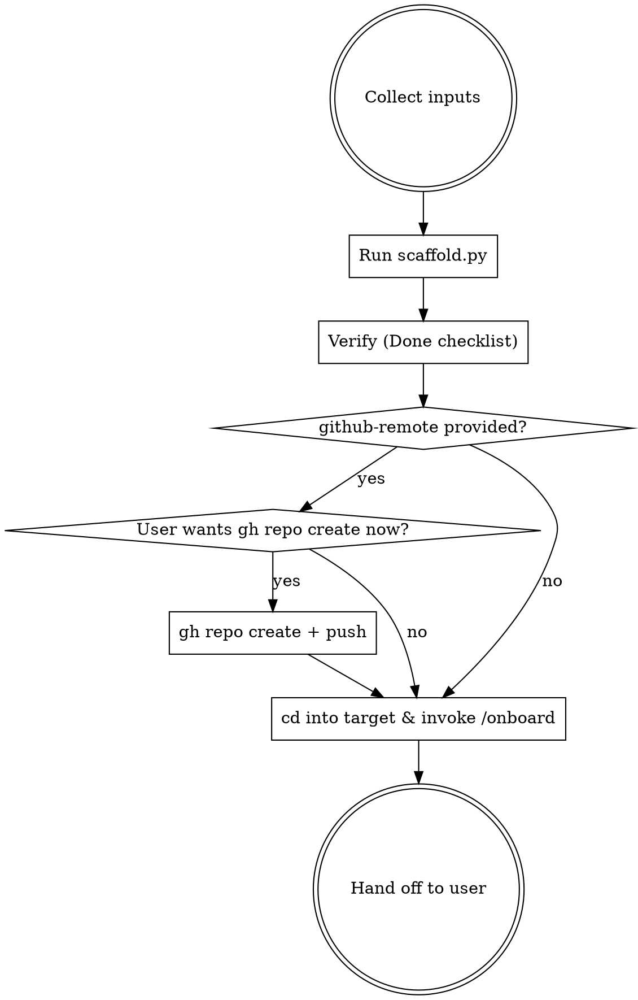

# init-harness

## When to use

- The user wants a brand-new `<topic>.harness` repo modelled on the proven layout: Makefile + CLAUDE.md + .knowledge/ + Zulip bridge + a thin project-level `onboard` skill that delegates to the `zlp-harness` plugin.
- Trigger phrases: "create a new harness for <X>", "scaffold a harness", "init harness", "/init-harness", "set up a harness like qec.harness for <X>", "bootstrap the <X>.harness repo".

Do NOT use when:
- The user already has a harness and just needs **their machine** wired up — that's the plugin's `zlp-onboard` skill, which the harness's project-level `onboard` chains into.
- The user only needs a Zulip stream and no repo — `zlp send` directly is enough.
- The user wants to add a **paper draft** (LaTeX) to an existing harness — different workflow; the `.gitignore` already has the LaTeX entries set up but no scaffolding for `main.tex` exists yet.

## What gets scaffolded

```
<topic>.harness/
  Makefile                        # zulip-* targets + zulip-config; ZULIP_STREAM/ZULIP_SITE/WORKSPACE substituted
  CLAUDE.md                       # repo conventions for future Claude sessions
  README.md                       # single-prompt onboarding instruction
  AGENTS.md                       # @CLAUDE.md
  .gitignore                      # LaTeX + .knowledge/.raw + .claude/settings.local
  .knowledge/
    INDEX.md                      # placeholder, overwritten on first download-ref run
  .claude/skills/onboard/SKILL.md # thin two-phase: enable plugin → delegate to zlp-harness:zlp-onboard
```

Personal Zulip state — credentials, archived messages, cursor state, drafts — never lands in the repo. It all lives in a single global workspace directory at `~/.local/share/zlp-harness/<workspace>/` (one per Zulip server, shared across every harness on that server). The repo working tree only holds syncable harness configuration.

The `zlp-onboard`, `download-ref`, `zulip-reply`, and `zlp-advisor` skills are **not** bundled per-repo — they are provided by the `zlp-harness` plugin. The only skill bundled into each harness is the project-level `onboard`, which exists to install/enable the plugin on a collaborator's first run and then delegate.

All scaffold templates are bundled inside this skill at `templates/`. The skill does **not** read from any other repo — it is a closed unit.

## Inputs (collect once, up front)

Bundle the questions into one `AskUserQuestion` exchange — don't ping per-field.

| Input | Default | Notes |
| --- | --- | --- |
| `topic` | (required) | lowercase, hyphenated slug. Examples: `qec`, `attention-solids`, `llm`. Used in repo / stream / file paths. |
| `target-dir` | (required) | absolute path or expression like `~/code/<topic>.harness`. Must be empty or non-existent (the helper refuses non-empty unless `--force`). |
| `zulip-stream` | `project-<topic>` | the stream the bridge will target. Must already exist on Zulip — created via the web UI by an admin. |
| `zulip-site` | `https://zulip.hkust-gz.edu.cn` | the Zulip server URL the harness uses. Override for non-hkust-gz sites (e.g. `https://quantum-info.zulipchat.com`). |
| `workspace` | derived from `zulip-site` | Zulip workspace slug — names the global directory `~/.local/share/zlp-harness/<workspace>/` that holds zuliprc + archived messages + cursor state. Default: take the host's leftmost label (e.g. `hkust-gz`, `quantum-info`). |
| `github-remote` | (optional) | `<org>/<repo>` for the README clone link, e.g. `CodingThrust/<topic>.harness`. Empty leaves a `<org>/<repo>` placeholder. |
| `topic-blurb` | (optional) | one paragraph for "Repository purpose". Empty leaves a TODO marker; user can edit `CLAUDE.md` afterwards. |
| `git-init` | yes / no | run `git init` + a single seed commit. Default yes. |

## Workflow



### Phase 1 — Scaffold

Run the bundled helper. The `SKILL_DIR` must point to wherever this skill is installed — if loaded from the `zlp-harness` plugin, use the plugin cache path; if loaded from `~/.claude/skills/init-harness`, use that. Claude: resolve this by finding `scaffold.py` via the skill's own directory (the directory containing this `SKILL.md`).

```sh
SKILL_DIR="<path-to-this-skill's-directory>"

python3 "$SKILL_DIR/helpers/scaffold.py" \
  --topic           "<topic>" \
  --target-dir      "<target-dir>" \
  --zulip-stream    "project-<topic>" \
  --zulip-site      "https://zulip.hkust-gz.edu.cn" \
  --workspace       "hkust-gz" \
  --github-remote   "CodingThrust/<topic>.harness" \
  --topic-blurb     "<one paragraph, or empty>" \
  --git-init                                      # omit to skip git init
```

The helper:
1. Validates `--topic` is lowercase + hyphenated.
2. Refuses to scaffold into a **non-empty** target unless `--force` is passed (don't pass `--force` without explicit user permission — the destination might be in-progress work).
3. Verifies all required template files exist inside `templates/` before writing anything.
4. Renders `Makefile`, `CLAUDE.md`, `README.md`, `.knowledge/INDEX.md` from `*.tmpl` with `<<TOPIC>>`, `<<ZULIP_STREAM>>`, `<<ZULIP_SITE>>`, `<<WORKSPACE>>`, `<<GITHUB_REMOTE>>`, `<<TOPIC_BLURB>>` substituted.
5. Copies `AGENTS.md` and `.gitignore` verbatim (no substitution needed — already generic).
6. Recursively copies `.claude/skills/onboard/SKILL.md` from `templates/skills/onboard/`. The thin project-level onboard skill goes through the same substitution pass so its frontmatter description mentions the topic.
7. If `--git-init`: `git init`, `git add .`, single commit `scaffold <topic>.harness from init-harness skill`.
8. Prints the file tree it wrote and a `next steps` block.

### Phase 2 — (Optional) create the GitHub repo

If `--github-remote` was provided AND `gh` is on `$PATH` AND the user agrees, run from inside `<target-dir>`:

```sh
cd "<target-dir>"
gh repo create "<github-remote>" --private --source=. --push \
  --description "Reference / discussion harness for <topic>."
```

Confirm with the user before running — `gh repo create` is observable to the org and pushes the seed commit. Don't bundle this into Phase 1 silently.

If the user wants to invite a collaborator afterwards:

```sh
gh repo edit "<github-remote>" --add-collaborator <github-handle>
```

Skip this whole phase if `github-remote` is empty.

### Phase 3 — Onboard the user to the new harness

The new harness ships a project-level `.claude/skills/onboard/SKILL.md`. It is a project-local skill — `Skill("onboard")` will resolve to it only when Claude Code is launched from inside the new harness directory.

```sh
cd "<target-dir>"
# Then read and follow .claude/skills/onboard/SKILL.md directly. It will:
#   1. (First call) edit ~/.claude/settings.json to enable the zlp-harness
#      plugin, then ask the user to restart Claude Code.
#   2. (After restart) delegate to Skill("zlp-harness:zlp-onboard") which
#      reads `make zulip-config` from this harness for site/path/stream
#      values, walks zlp-cli + zuliprc + verification, runs the
#      initial message sync, and recommends adding key refs.
```

Notes:
- If the user has already enabled `zlp-harness` from a previous harness, Phase A is a no-op and Phase B chains in immediately — no restart needed.
- If `<zulip-stream>` doesn't yet exist on Zulip, `make zulip-topics` returns nothing (or an error). The bridge **cannot** auto-create the stream — an admin must create it via the Zulip web UI first. Tell the user; don't try to work around it.
- The bundled project-level onboard is site-agnostic — its description field stays generic, no per-harness patching needed beyond the topic substitution that Phase 1 already does.

### Phase 4 — Hand off

Print a tight summary so the user knows what they own next:

```
Harness scaffolded at <target-dir>.

Next steps for the user:
  1. cd <target-dir>
  2. Edit CLAUDE.md — fill in "Repository purpose" and any linked external repos
     (group code, scratchpad issue trackers).
  3. Add the first references via the `download-ref` skill.
  4. (If you skipped Phase 2) push to GitHub manually and invite collaborators.
  5. Tell collaborators to clone and run /onboard.
```

## Common mistakes

| Mistake | Fix |
| --- | --- |
| Picking a `topic` with uppercase / spaces (e.g. `Attention Solids`) | Use lowercase, hyphenated (`attention-solids`). The slug appears in repo names, stream names, file paths — none of those should need shell quoting. The helper refuses uppercase / whitespace and exits 2. |
| Pointing `--target-dir` at a populated directory | The helper refuses unless `--force` is passed. Don't pass `--force` without explicit user OK — you might clobber in-progress work. Pick a fresh directory instead. |
| Reading from `.../qec/.claude/skills/...` while running this skill | Don't. This skill is **standalone**: every template lives under this skill's `templates/` directory. If you find yourself hand-copying from another repo, you've taken a wrong turn — re-run the helper. |
| Skipping the GitHub-remote question because it's "optional" | Ask anyway. Without it the README contains a `<org>/<repo>` placeholder that breaks the one-line onboarding paste in `README.md`. Easier to set it now than retrofit. |
| Pointing `ZULIP_STREAM` at a stream that doesn't exist on Zulip yet | The bridge can't create streams. Have the user (or Zulip admin) make the stream on the web UI first; only then will `make zulip-topics` succeed. |
| Mixing up `--zulip-site` and `--workspace` | `--zulip-site` is the full URL (`https://...`); `--workspace` is the slug used in the workspace directory path (`hkust-gz`, `quantum-info`). The helper derives the latter from the host if you don't pass it. |
| Running Phase 3's `/onboard` without `cd`-ing into the new repo | The project-level `onboard` only exists inside the new harness; running it from elsewhere either picks up a different harness's onboard or fails to find one. Always switch directories before invoking. |
| Editing the templates without testing the next scaffold | `templates/` is the source of truth for every future harness; a typo here propagates. After editing any `*.tmpl`, run the helper into a scratch directory to verify the rendered output is what you expected. |
| Bundling `__pycache__/` from the local machine into `templates/` | The helper's `rglob` skips `__pycache__` parts explicitly, but be aware. |

## Done checklist

After the helper finishes, verify (the user might do this themselves; if they don't, you do):

- [ ] `<target-dir>/Makefile` exists; `grep ZULIP_STREAM <target-dir>/Makefile` shows the new stream name (not `<<ZULIP_STREAM>>` and not `project-qec`).
- [ ] `make -C <target-dir> zulip-config` prints `ZULIP_SITE=...`, `ZULIP_STREAM=...`, `ZULIP_WORKSPACE=...`, `ZULIP_WORKSPACE_DIR_DEFAULT=...`, `ZULIP_DRAFTS_DIR=...` and exits 0 on a fresh clone.
- [ ] `grep -r '<<TOPIC>>\|<<ZULIP_STREAM>>\|<<ZULIP_SITE>>\|<<WORKSPACE>>\|<<GITHUB_REMOTE>>\|<<TOPIC_BLURB>>' <target-dir>` returns nothing (all placeholders substituted).
- [ ] `<target-dir>/.claude/skills/onboard/SKILL.md` exists.
- [ ] `<target-dir>/.knowledge/INDEX.md` exists with the topic name in its title line.
- [ ] If `--git-init`: `<target-dir>/.git/` exists and `git -C <target-dir> log --oneline` shows the seed commit.
- [ ] If Phase 2 ran: `gh repo view <github-remote>` succeeds.
- [ ] If Phase 3 ran: `make -C <target-dir> zulip-whoami` returns the user's account (assuming the Zulip stream exists on the server and the plugin is loaded).
- [ ] User has been told to edit `CLAUDE.md`'s "Repository purpose" placeholder.
