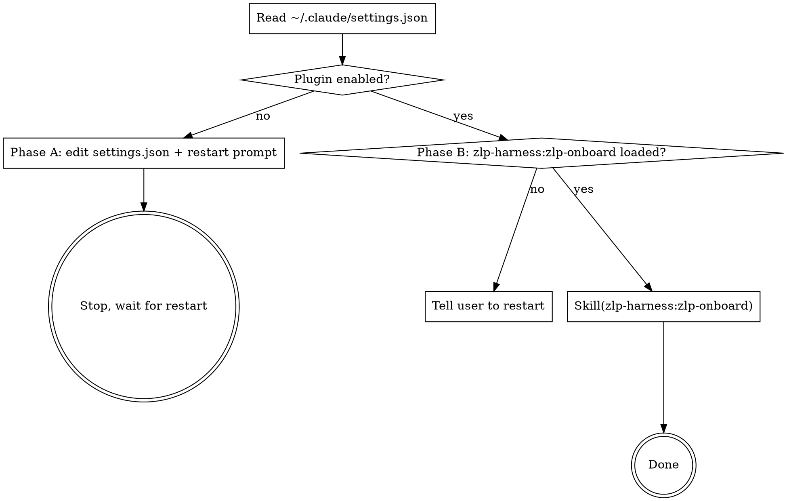

# onboard — <<TOPIC>>.harness

This is a thin two-phase skill. Its only jobs are (A) installing/enabling the [`zlp-harness`](https://github.com/GiggleLiu/zlp-harness) plugin in the user's global Claude Code settings, and (B) delegating to that plugin's `zlp-onboard` skill once it's loaded. All site-specific values (Zulip URL, default workspace path, stream name) come from this repo's `make zulip-config` — the plugin reads them, this skill does not.

## When to use

- The user just cloned this repo and is running `/onboard` for the first time.
- `make zulip-whoami` errors out (`ZULIP_WORKSPACE is not set`, `command not found: zlp`, missing `zuliprc`, etc.) and the user wants help.

Do NOT use:
- For an existing setup hitting a transient error — debug it first.
- To install zlp-harness for an *unrelated* harness — let that harness's own `/onboard` do it (each harness ships its own copy of this skill).

## Workflow



### Step 0 — Detect which phase to run

```sh
python3 - <<'PY'
import json, pathlib, sys
p = pathlib.Path.home() / ".claude/settings.json"
if not p.exists():
    print("PHASE_A"); sys.exit(0)
try:
    data = json.loads(p.read_text())
except json.JSONDecodeError as e:
    print(f"PARSE_ERROR: {e}"); sys.exit(0)
ok = (data.get("enabledPlugins", {}).get("zlp-harness@zlp-harness") is True
      and "zlp-harness" in data.get("extraKnownMarketplaces", {}))
print("PHASE_B" if ok else "PHASE_A")
PY
```

- `PHASE_A` → run **Phase A**.
- `PHASE_B` → run **Phase B**.
- `PARSE_ERROR: ...` → **abort**. The user's `~/.claude/settings.json` has a syntax error. Tell them to fix it manually (the error message includes line / column) and re-run `/onboard`. Do **not** overwrite a corrupt file.

### Phase A — Enable the plugin

The user is editing their *global* Claude Code config. Show the diff before applying it.

```
The /onboard flow is going to add this to your ~/.claude/settings.json:

  "extraKnownMarketplaces": {
    "zlp-harness": {
      "source": { "source": "github", "repo": "GiggleLiu/zlp-harness" }
    }
  },
  "enabledPlugins": {
    "zlp-harness@zlp-harness": true
  }

This enables the zlp-harness plugin globally — it will be active in every
Claude Code session, not just this repo. The plugin provides the
`zulip-reply` and `download-ref` skills used here. Continue? (yes / no)
```

If the user agrees, do the merge — preserving any unrelated keys already in their settings file:

```sh
python3 - <<'PY'
import json, pathlib
p = pathlib.Path.home() / ".claude/settings.json"
data = json.loads(p.read_text()) if p.exists() else {}
data.setdefault("extraKnownMarketplaces", {})
data["extraKnownMarketplaces"]["zlp-harness"] = {
    "source": {"source": "github", "repo": "GiggleLiu/zlp-harness"}
}
data.setdefault("enabledPlugins", {})
data["enabledPlugins"]["zlp-harness@zlp-harness"] = True
p.parent.mkdir(parents=True, exist_ok=True)
p.write_text(json.dumps(data, indent=2) + "\n")
print(f"updated {p}")
PY
```

Then **stop and tell the user to restart**:

```
✓ zlp-harness plugin enabled in ~/.claude/settings.json.

Now restart Claude Code so the plugin loads:

  1. Run /exit in this session.
  2. Re-launch `claude` from this directory.
  3. Run /onboard again — it will pick up where this left off and walk
     you through the Zulip account setup.
```

Do **not** attempt to invoke `Skill("zlp-harness:zlp-onboard")` in this same session — the plugin isn't loaded until restart.

### Phase B — Delegate to the plugin

1. **Confirm the plugin's skill is actually loaded.** The available-skills system reminder at session start lists every registered skill (project-local + plugin); look for `zlp-harness:zlp-onboard`. If it's missing, the user enabled the plugin in settings but didn't restart — print:

   ```
   The zlp-harness plugin is enabled in your settings but doesn't seem to be
   loaded in this Claude Code session yet. Please /exit and re-launch
   `claude` from this directory, then run /onboard again.
   ```

   Stop. Don't try to invoke.

2. **Invoke the plugin's skill:**

   ```
   Skill("zlp-harness:zlp-onboard")
   ```

   It reads `make zulip-config` from this repo's Makefile to learn the site URL, default workspace path, and stream name, then walks the user through `zlp-cli` install, `zuliprc` placement, `ZULIP_WORKSPACE` export, verification with `make zulip-whoami`, and the initial `make zulip-pull IMPORT_HISTORY=1`.

3. After `zlp-harness:zlp-onboard` finishes, you're done — no extra steps. The user can immediately use `/zulip-reply` and `/download-ref` (also from the plugin).

## Done checklist

- [ ] `~/.claude/settings.json` contains both `extraKnownMarketplaces["zlp-harness"]` and `enabledPlugins["zlp-harness@zlp-harness"]: true`.
- [ ] In a fresh Claude Code session, the available-skills system reminder lists `zlp-harness:zlp-onboard`, `zlp-harness:zulip-reply`, `zlp-harness:download-ref`.
- [ ] `make zulip-whoami` from the repo root prints the user's account.
- [ ] `.zulip/` populated by `make zulip-pull IMPORT_HISTORY=1`.

## Common mistakes

| Mistake | Fix |
| --- | --- |
| Trying to invoke `Skill("zlp-harness:zlp-onboard")` in Phase A (same session as the install) | Plugins only load at session start. Phase A always ends with a restart prompt; Phase B is a separate run. |
| Overwriting a syntactically-invalid `~/.claude/settings.json` | The Step 0 check returns `PARSE_ERROR` — abort and ask the user to fix the JSON manually. Never write into a corrupt file. |
| Using a flat dict assignment that clobbers the user's existing `enabledPlugins` block | Use `data.setdefault("enabledPlugins", {})` then assign the single key. The Python snippet above does this correctly; don't simplify it into `data["enabledPlugins"] = {...}`. |
| Hardcoding `zulip.hkust-gz.edu.cn` or any other site URL into the prompts shown to the user | This skill is workspace-agnostic. All site-specific values come from `make zulip-config`, which the plugin's `zlp-onboard` reads — not this skill. |
| Running `/onboard` from outside the harness's repo root | The cwd matters once we delegate — `make zulip-config` only resolves inside this repo. |
