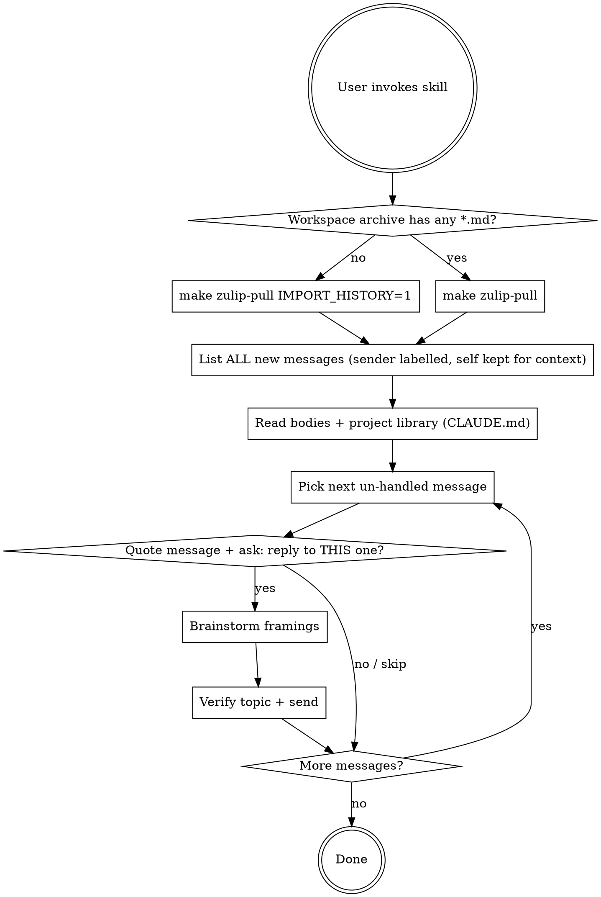

# zulip-reply

## Overview

Mirror the project's Zulip stream into the workspace archive, scan the newest co-author messages, ground them in the project library, and brainstorm a reply with the user.

**Project-specific values — stream name, archive layout, library locations, search recipes — live in `CLAUDE.md` (under "Zulip channel"). The integration interface is a set of `make zulip-*` targets that each project provides; this skill calls them by name and lets the project's Makefile decide what runs underneath. Do not bypass the targets to call the underlying tool directly.**

The archive lives in the global workspace directory reported by `make zulip-config` (`ZULIP_WORKSPACE_DIR_DEFAULT`, or a user-supplied `ZULIP_WORKSPACE_DIR` override). Drafts staged for `MSG_FILE=` go under `ZULIP_DRAFTS_DIR` from the same target.

## When to use

- User asks to read recent Zulip discussion or "what's new on chat".
- User wants to draft / review a reply to a co-author message.
- The workspace archive needs to be created or refreshed.

Do NOT use when the user just wants to send a one-off message — `make zulip-send` is enough.

## Workflow



### Step 1 — Pull

Resolve the workspace path once, then detect initialization:

```sh
eval "$(make zulip-config | sed 's/^\([^=]*\)=\(.*\)$/CFG_\1=\x27\2\x27/')"
WS_DIR="${ZULIP_WORKSPACE_DIR:-$CFG_ZULIP_WORKSPACE_DIR_DEFAULT}"
find "$WS_DIR" -path '*/.*' -prune -o -name '*.md' -print -quit 2>/dev/null
```

- **Empty → not initialized.** Run `make zulip-pull IMPORT_HISTORY=1` (full history; attachments land in sibling `_files/` dirs).
- **Non-empty → initialized.** Run `make zulip-pull` for incremental catch-up.

If the pull reports `archived=N` with N > 0, those are exactly the new files. If `archived=0`, no new traffic — fall back to listing the most recently-modified `.md` files.

**Keep self-authored messages — do NOT filter them out.** `make zulip-pull` mirrors the user's own outgoing replies too, and those carry essential context: what stance the user already took, what they already asked, what they've already promised. Run `make zulip-whoami` once per session to learn the display name, and use it to **label** each message's sender in the summary (e.g. `Mingrui` vs. `you`). Never silently drop self-messages. The only thing the user-self label does is tell you not to draft a reply *to themselves*.

### Step 2 — Build context from new messages

For **every** new message (co-author *and* self):

- Parse YAML frontmatter (`sender_full_name`, `timestamp`, `subject`, `permalink`, `_archive.attachments`).
- Read the body (after the closing `---`).
- Open every file in `_archive.attachments` from the sibling `_files/` dir.
- Read 3–5 surrounding messages in the same `subject` folder for thread context, not just the new one in isolation.

Summarize as a single chronological list — preserve sender labels so the user (and you) can see the full conversation, including their own posts:

```
- Mingrui @ 2026-04-29 02:30 [channel events]: <one-line gist> — <permalink>
  attachments: <names if any>
- you @ 2026-04-26 15:45 [channel events]: <one-line gist of your own message> — <permalink>
- Xin @ 2026-04-25 12:37 [channel events]: …
```

The self-label only changes one downstream choice in Step 3: do not propose drafting a reply *to a self-authored message*. Self-messages remain in the visible list for context.

### Step 2b — Search the project library

This step turns a generic chat reply into one grounded in the project. **Do this before drafting**, even if the user hasn't asked for a reply yet — surfacing relevant references lets them decide whether to engage.

Read `CLAUDE.md` for the project's library map and search recipes. Typical sections to consult:

- **Knowledge base** — usually `.knowledge/` with an `INDEX.md` and a documented `rg` recipe. Use that recipe verbatim; don't invent a different one.
- **Documents / Bibliography** — the `.tex` and `.bib` files where co-authors' citations and section/figure names resolve.

For each paper title, author surname, technical term, or LaTeX construct mentioned in the new traffic, run the project's documented search recipe over those locations. Show findings inline:

```
Context found for <sender>'s message:
- <library-file> — <one-line relevance>
- <source-file>:<line> — defines the figure / section / symbol they referenced
- <bib-key> — the citation they're invoking
```

If a topic is *missing* from the project library, say so explicitly — that's a useful signal (the user may want to add the reference before replying).

### Step 3 — Walk the messages one by one (only if user wants to engage)

**Process new co-author messages strictly one at a time, in chronological order.** Do *not* present a global "which one(s) do you want to reply to?" menu — that forces the user to plan the whole batch in advance and tends to drop messages on the floor. Instead, for each un-handled co-author message:

#### 3.0 Show the message, then ask: reply to this one?

For the current message, **always quote the original body inline before asking** — even if you summarized it earlier in Step 2. The user needs to see what they'd be replying to without scrolling back. Format:

```
Message <i> of <N> — <sender> @ <local time> [<topic>]
Permalink: <permalink>
Attachments: <names if any>

> <full message body, quoted with leading "> ">
> <multi-line bodies stay quoted line-by-line>

(Optional: 1–3 lines of project-library grounding lifted from Step 2b — only the bullets that bear on *this* message.)

Reply to this one? (yes / skip / done)
```

- **yes** → continue to 3a–3d for this message.
- **skip** → mark handled, loop to the next message.
- **done** → stop the walk; remaining messages are dropped from this session.

If the user authored the current message themselves (self-label from Step 2), do **not** ask "reply to this one?" — just acknowledge it's their own and move on; self-messages are visible in the listing only to provide context for what they've already said in the thread.

#### 3a–3d (per message that gets a "yes")

**Early exit:** if the user's "yes" already pins stance + audience + length + key points (e.g. "yes, ack and ask for the Tancik ablation, 2 short paragraphs"), skip to 3d and draft directly. Show one draft plus one alternative framing flagged at the bottom.

Otherwise:

- **3a. Restate, then ask one multiple-choice question.** Mirror what the message is claiming, then ask **exactly one** clarifying question — prefer a/b/c options over open-ended.
- **3b. Iterate.** One question per turn. Stop once you know (i) stance, (ii) audience, (iii) constraints. State obvious assumptions inline rather than asking.
- **3c. Propose 2–3 genuinely distinct framings with trade-offs**, recommended first. Wait for the user to pick before drafting.
- **3d. Draft, then approve.** Plain Markdown, short paragraphs, prefer permalinks over re-quoting. Show inline. Do **not** send until the user explicitly approves. If the user edits, their version wins.

After a successful Step 4 send (or a skip), loop back to 3.0 with the next un-handled message until the list is empty or the user says "done."

See **Zulip rendering quirks** below for formatting rules.

### Step 4 — Send

**Verify the topic exists first.** Zulip silently creates a new topic if `TOPIC=` doesn't match — fragments the discussion:

```sh
make zulip-topics | grep -F "<topic>"
```

If grep returns nothing, confirm with the user that creating a new topic is intentional, or fix the spelling. Topic strings are case- and whitespace-sensitive.

Send via the Makefile:

```sh
make zulip-send TOPIC="<topic>" MSG_FILE=<path-to-draft.md>
```

Use `MSG_FILE` (a temp file under `$CFG_ZULIP_DRAFTS_DIR` — workspace's `.drafts/` subdir, never inside the repo) for any reply longer than one line; `MSG=` requires shell-escaping.

**Never add a signature.** No name tag, no "(drafted with AI)", nothing. The account name is the only attribution. If the user explicitly asks to flag a message as AI-drafted, ask them to write the wording — don't invent one.

After sending, run `make zulip-pull` again to mirror your own message back and get a permalink. If `archived=0` despite a returned `id=…`, the cursor lagged — retry the pull once.

## Zulip rendering quirks

| Element | Rule |
| --- | --- |
| **Inline math** | Use `$$…$$`, never `$…$`. Zulip's KaTeX silently leaves single-dollar fragments as plain text. |
| **Display math** | Same: `$$…$$`. No separate display delimiter. |
| **Code spans** | Single backticks render normally; triple-backtick fences accept language hints. |
| **Emoji** | `:emoji_name:` syntax; Unicode emoji also work. |
| **Mentions** | `@_**Display Name|user_id**` is the silent-mention syntax archived in frontmatter — copy verbatim from a permalink, don't retype. |
| **Names** | Never invent non-Latin name characters from a romanization. Use the romanized form as-is or the `@_**…|user_id**` mention copied from frontmatter — multiple character spellings can map to the same romanization and the archive can't disambiguate. |
| **Signature** | None. Ever. (See Step 4.) |

## Quick reference

The project provides these `make` targets as the integration interface (see `CLAUDE.md` for the underlying values):

| Need | Command |
| --- | --- |
| First-time mirror | `make zulip-pull IMPORT_HISTORY=1` |
| Incremental catch-up | `make zulip-pull` |
| Identify self | `make zulip-whoami` |
| List topics | `make zulip-topics` |
| Verify a topic before send | `make zulip-topics \| grep -F "<topic>"` |
| Print recent messages without archiving | `make zulip-messages LIMIT=20` |
| Send | `make zulip-send TOPIC="…" MSG_FILE=…` |
| Detect initialization | `find "$CFG_ZULIP_WORKSPACE_DIR_DEFAULT" -path '*/.*' -prune -o -name '*.md' -print -quit` |
| Project library search recipes | See `CLAUDE.md` |

## Common mistakes

These are gotchas that won't be obvious from the Makefile or `make help`:

| Mistake | Fix |
| --- | --- |
| Silently dropping the user's own messages from the listing | Keep them. Label sender as "you" so the user sees what they themselves already said in the thread — that's part of the context. Self-label only suppresses "reply to this one?" prompting, not visibility. |
| Mislabelling a co-author message as the user's (or vice versa) | The sender label comes from `sender_full_name` in frontmatter, compared against `make zulip-whoami` output. Don't infer from prose style. |
| Presenting the new traffic as a single "which one(s) do you want to reply to?" menu | Walk messages one at a time (Step 3.0). For each co-author message, **quote the original body inline** before asking yes/skip/done. This stops the user from having to plan the whole batch up front. |
| Asking "reply to this one?" without re-quoting the original body | Always include the quoted body, even if you summarized it earlier — the user shouldn't have to scroll back. |
| Drafting a generic reply without consulting `CLAUDE.md` for project-library search | Step 2b is mandatory — even short replies should reference what's already on disk. |
| Sending to a typo'd `TOPIC=` (silently creates a new topic) | `make zulip-topics \| grep -F "<topic>"` first. Mismatch = fragmented thread. |
| Adding a signature of any kind | Don't. Account name is the only attribution. |
| Treating `archived=0` as a failure | It just means no new messages since last pull. |
| Forgetting attachments referenced in `_archive.attachments` | Defaults pull them; always open `_files/` entries before replying. |
